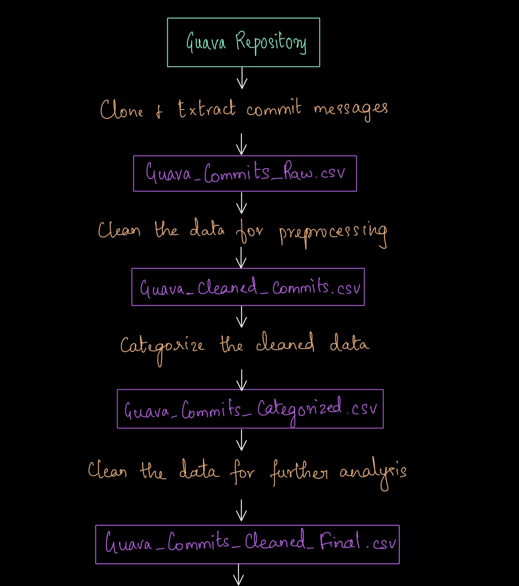
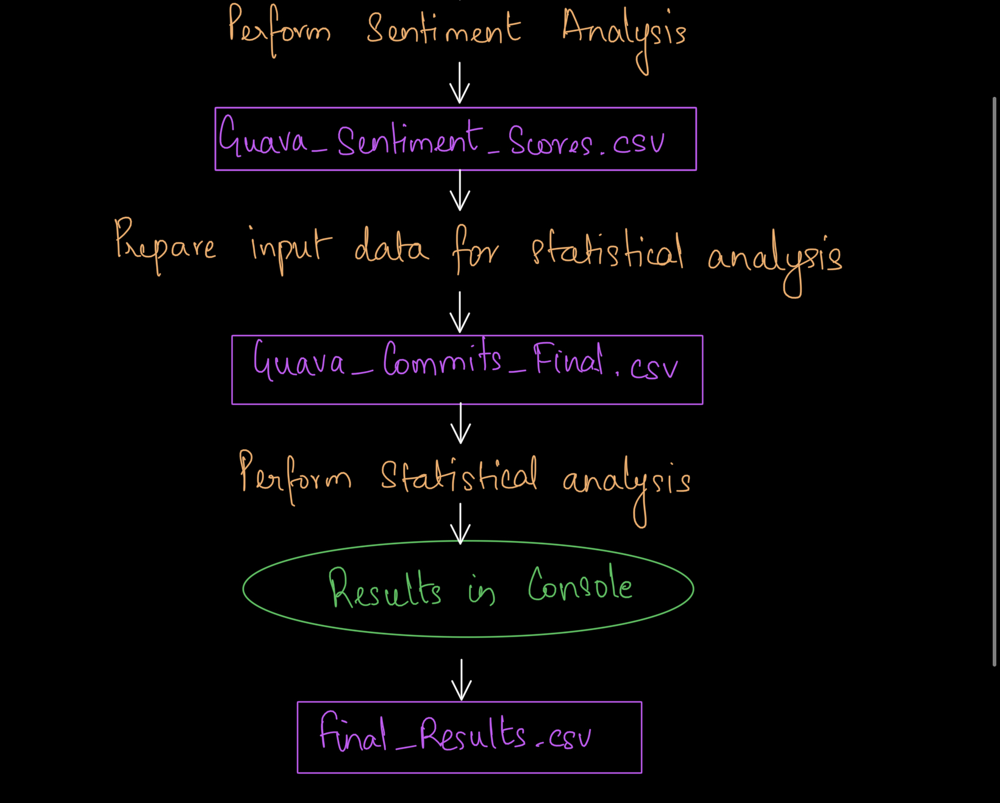

# MSR-Assignment-2
Mining Software Repositories project to analyze Github Commits and use sentiment analysis to check whether there is correlation between negative human sentiment and Faulty Commits which may induce Fixes by Developers.

A reproduction as part of the MSR course at MSR course 2020/21 at UniKo, CS department, SoftLang Team 

Please cite the following paper if you intend to know more about the original research 

>  **Is Developer Sentiment Related to Software Bugs: An Exploratory Study on GitHub Commits**
  https://ieeexplore.ieee.org/document/9054801
  
> **DBLP Link:**
  https://dblp.org/rec/conf/wcre/HuqSS20.html

## Requirements:

To run this project, you will need

Python IDE (Jupyter Notebook or PyCharm), Python3+ must be installed on the system.
	
Execute the below commands in the terminal based on your OS
```
	Unix/macOS
	python -m pip freeze > requirements.txt
	python -m pip install -r requirements.txt

	Windows
	py -m pip freeze > requirements.txt
	py -m pip install -r requirements.txt

```
## Process: 

  * **Step1:**
  Clone the project into your local machine

  * **Step2:**
  Execute the requirements commands in the terminal based on your OS

  * **Step3:**
  Change directory to the process folder and execute the below commands
  ```cd Process```

  * **Step4:**
  Execute the code present in the Process folder in the IDE


## Validation: 

Check the generated output files in the below order to validate and understand the result

**1)Guava_Commits_Raw.csv** - The cloned repository commit messages

**2)Guava_Cleaned_Commits.csv** - The cleaned commit messages

**3)Guava_Commits_Categorized.csv** - The categorised messages

**4)Guava_Commits_Cleaned_Final.csv** - The clean data after categorisation

**5)Guava_Sentiment_Scores.csv** - The sentiment values for each message

**6)Guava_Commits_Final.csv** - The final output which will be used for statistical analysis including the categories and the sentiment values

**7)Final_Results.csv** – The final statistical inference


## Data: 

Input data is the extracted messages from the cloned repository, the remaining files created as part of the program are all intermediate files.
The final results are printed as part of the console
 
 

## Delta: 

### Process delta: 

* The original process followed in the research paper applies to 13 different GitHub repositories to collect a strong inference on the actual research. With respect to reproducing the research, we have applied the research steps on only 1 repository to avoid scalability issues. 

* The sentiment analysis performed in the original research paper involves Senti4SD tool but due to the corrupted jar file within the Senti4SD code, we chose to alternatively go for NLTK Vader Sentiment analysis.

* Mann-Whitney U Test (aka, Wilcoxon Rank Sum Test) has been implied on the data for statistical analysis despite the fact that Wilcoxon Rank Sum Test was used in the research paper since both are officially the same. Both are known to produce similar results but with minute differences.

### Data delta: 

* Due to no underlying piece of code in the research paper, we have developed the code from scratch using Python and its libraries to perform pre-processing, categorization, sentiment analysis and statistical analysis on the input data. 

* Among the multiple categories in which the data was split into, we have left out the non-FIF FC category as there was no clear understanding about this categorization in the paper and we were not ready to try out the categorization on the basis of our assumption.

* The p-values resulting from Bonferroni corrections is mostly 1 which means that the Mean values of the comparing data is almost same. This is inevitable as there is minor difference between the sentiment values among the different categories.

* The result in the research paper involves a combination of 13 huge repositories wherein we assume the results that we got from our reproduction project is different since we considered only one medium sized repository for this task and that the repository might be biased.


